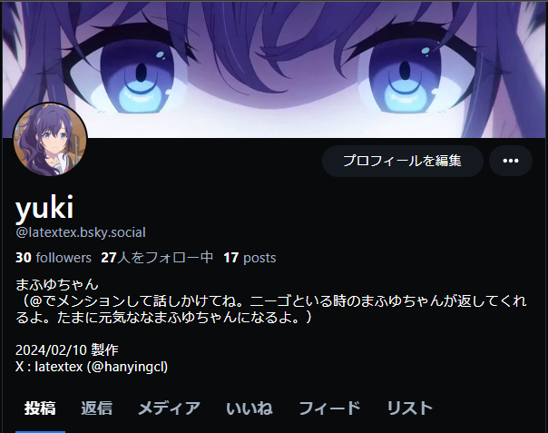

# Voice Agent Use Local LLM and TTS

Youtube Demo Here! ⇩

<div><video controls src="https://github.com/teftef6220/Local_LLM_bot/assets/56711067/753c24c6-e75e-44cf-85b4-94c0d4fcd291" muted="false"></video></div>


## Introduction
This is a sample project to demonstrate how to use local LLM and TTS in Voice Agent.
Using rinna/japanese-gpt-neox-3.6b-instruction-sft as LLM and Style-Bert-Vits-2 as TTS.


## Installation

### 1. Clone the repository
```bash
git clone https://github.com/teftef6220/Local_LLM_bot.git
cd Local_LLM_bot
```
### 2. Make Venv
```bash
python -m venv venv
source venv/bin/activate
```

### 3. Install requirements

Install pytorch and torchaudio and torchvision from [official website](https://pytorch.org/get-started/locally/)

```bash
pip install torch torchvision torchaudio --index-url https://download.pytorch.org/whl/cu118
```

**Install cudnn from [official website](https://developer.nvidia.com/cudnn)**

Install another requirements
```bash
pip install -r requirements.txt
```

### 4. Fine-tune LLM
Fine-tune LLM with your data. 

Use Colab notebook to fine-tune LLM. You can use this notebook.

 [](https://colab.research.google.com/drive/16oKXPZoU8FjkmZkJyMXZam08I0KTDEqP?usp=sharing)

You can use 

- [rinna/japanese-gpt-neox-3.6b-instruction-sft](https://huggingface.co/rinna/japanese-gpt-neox-3.6b-instruction-sft) 
- [rinna/japanese-gpt-neox-3.6b-instruction-sft-v2](https://huggingface.co/rinna/japanese-gpt-neox-3.6b-instruction-sft-v2)
- [google/gemma-2b-it](https://huggingface.co/google/gemma-2b-it)
- [google/gemma-7b-it](https://huggingface.co/google/gemma-7b-it)
- [tokyotech-llm/Swallow-7b-instruct-hf](https://huggingface.co/tokyotech-llm/Swallow-7b-instruct-hf)
- [tokyotech-llm/Swallow-13b-instruct-hf](https://huggingface.co/tokyotech-llm/Swallow-13b-instruct-hf)


as a pretrained model.


### 5. Fine-tune TTS
Fine-tune TTS with your data. You can use [Style-Bert-Vits-2](https://github.com/litagin02/Style-Bert-VITS2) as a pretrained model.

[](http://colab.research.google.com/github/litagin02/Style-Bert-VITS2/blob/master/colab.ipynb)

### 6. Set up Voice Agent

Put your fine-tuned LLM dir in [llm_models directory](./llm_models) 

```
llm_models
    |
    |---model_instance_dir
        |
        |---adapter_model.bin
        |---adapter_model.json
```

and put your fine-tuned TTS dir in [Voice_models directory](./Voice_models).
```    
Voice_models
    |
    |---model_name
        |
        |---model_name_e100_s2000.safetensors
        |---config.json
        |---style_vectors.npy
```

### 7. Run Voice Agent

Set config in [all_config.py](./config/all_config.py)


```bash
python llm_agent.py
```

### 8. Bluesky bot
 Also provided a simple [Bluesky bot](https://bsky.app/profile/latextex.bsky.social) that uses the Local LLM. You can run it with the following command.


#### 8.1. Use Bluesky bot

<p align="center">
  
</p>

you can mention the bot and the bot will reply to your mention.like

```
@latextex.bsky.social ねえ、名前教えてよ
```

set .env file as below
```
BS_USER_NAME = "your email address"
BS_PASSWORD = "your password"
```
and run the bot with the following command.

```bash
python blue_sky_bot.py
```

this bot can detect mentions and reply to your mentions use LLM.


## Credits

- [litagin02/Style-Bert-VITS2](https://github.com/litagin02/Style-Bert-VITS2)  

- [fishaudio/Bert-VITS2](https://github.com/fishaudio/Bert-VITS2)

## License

This project is licensed under the Affero General Public License v3.0 - see the [LICENSE](LICENSE) file for details.

